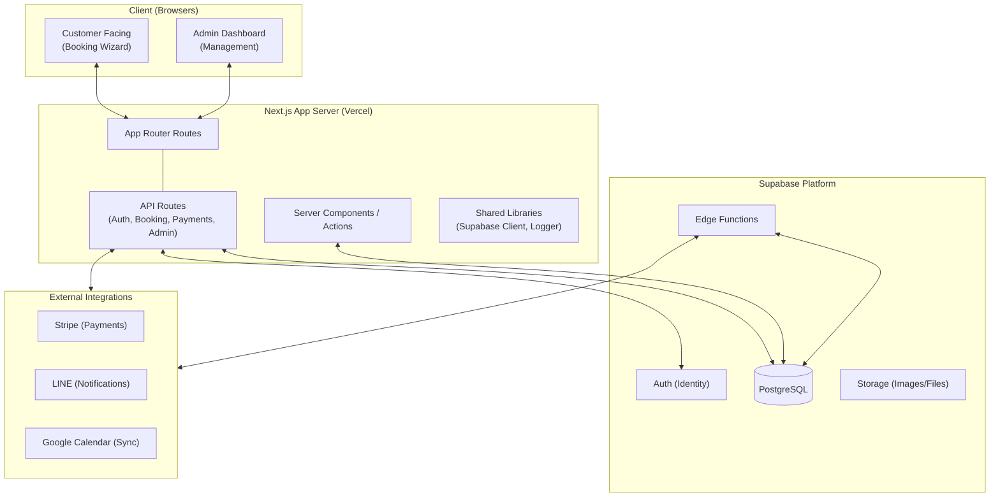

# Architecture Diagram - Amber Booking System

Amber is a multi-tenant SaaS platform built with Next.js and Supabase, designed for professional cleaning services.

## High-Level Architecture



## Data Model (SaaS Structure)

```mermaid
erDiagram
    ORGANIZATION ||--o{ STORE : owns
    ORGANIZATION ||--o{ PROFILE : employs
    
    STORE ||--o{ SERVICE : offers
    STORE ||--o{ BOOKING : receives
    STORE ||--o{ STAFF : manages
    STORE ||--o{ CUSTOMER : manages (scoped)
    
    STAFF ||--o{ BOOKING : assigned_to
    STAFF |o--|| PROFILE : linked_to
    
    CUSTOMER ||--o{ BOOKING : makes
    CUSTOMER ||--o{ HOUSE_ASSET : owns
    
    BOOKING ||--o{ BOOKING_ITEM : "contains"
    BOOKING ||--o{ PAYMENT_EVENT : tracks
    BOOKING ||--o| INVOICE : generates
```

## Key Components

- **Multi-Tenancy**: Controlled via the `organizations` table. Every record (Store, Profile, Booking, etc.) is scoped to an `organization_id`.
- **RBAC (Role Based Access Control)**: Managed through the `profiles` table with standardized roles:
    - `hq_admin`: Full access within an organization.
    - `store_admin`: Full access within a specific store.
    - `field_staff`: Access to assigned bookings and personal schedule.
    - `customer`: Access to personal bookings and assets.
- **Booking Pipeline**: 
    1. Customer selects services via `BookingWizard`.
    2. Availability checked via `/api/availability-v2` (Capacity-based).
    3. Payment processed via Stripe (optional).
    4. Notifications sent via LINE/Email.
- **Resource Management**: Plan-based limits (`max_stores`, `max_staff`, etc.) are enforced at the Organization level based on `plan_type`.
- **Soft Delete**: Implemented across major entities using the `deleted_at` column to preserve historical data.
