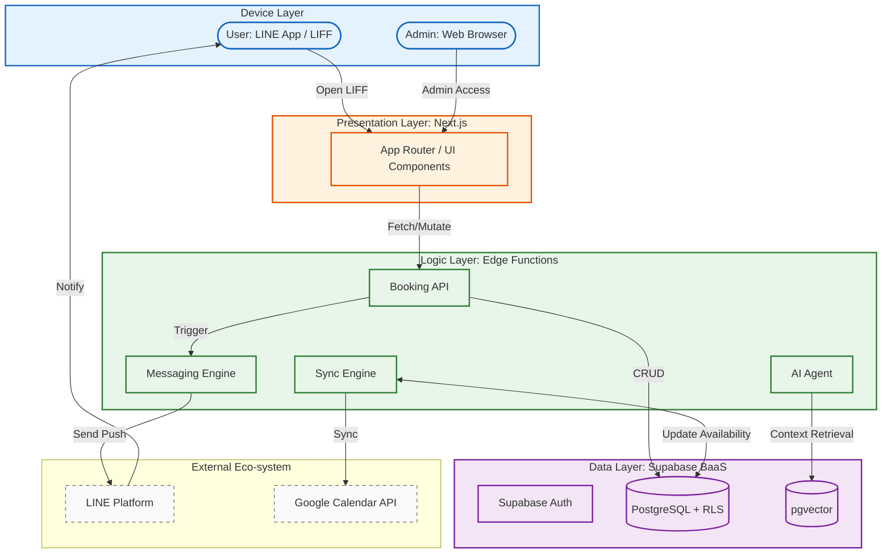
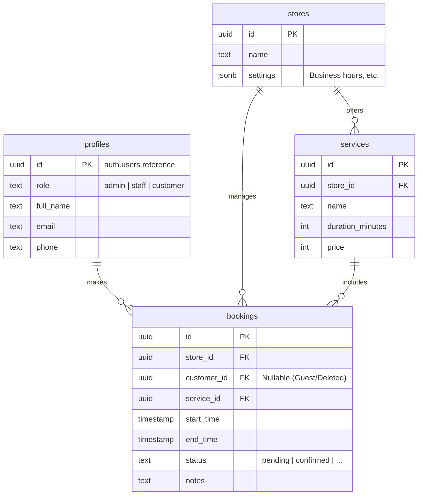
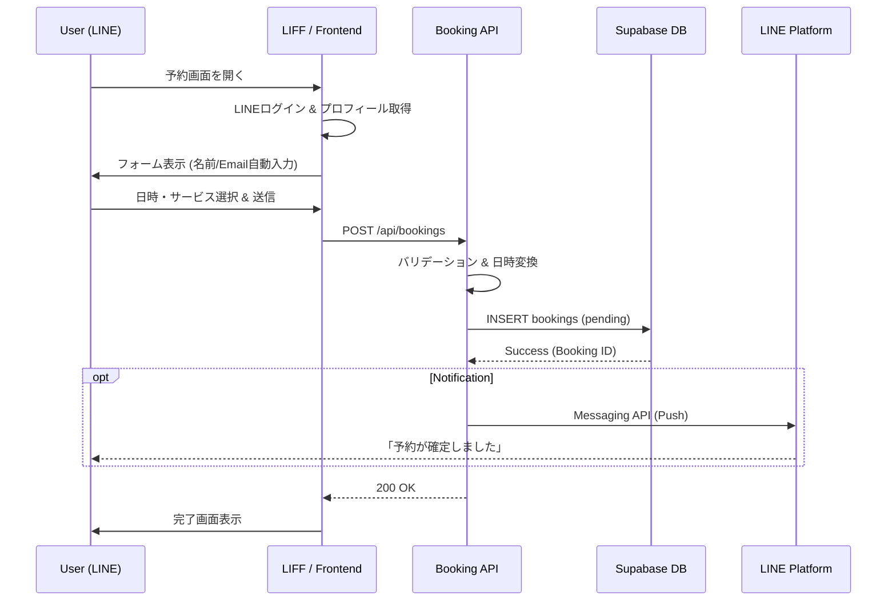

# Haukuri Pro システム詳細設計書

## 1. 全体アーキテクチャ (System Architecture)

LINEを起点としたUX（LIFF）と、拡張性を重視したバックエンドレス/サーバーレス構成です。



---

## 2. データベース設計 (ER Diagram)

Supabase (PostgreSQL) を使用し、マルチテナント対応のためにRLS (Row Level Security) を適用します。



---

## 3. 予約フロー (Booking Flow)

ユーザーがLINEから予約を行い、完了通知を受け取るまでのプロセスです。



---

## 4. 空き枠計算ロジック (Availability Logic)

現状はシンプルな重複チェックですが、将来的には以下のロジックで判定します。

1.  **店舗営業時間**: `stores.settings` から営業時間を取得。
2.  **サービス所要時間**: `services.duration_minutes` を取得。
3.  **既存予約**: `bookings` テーブルから対象日の予約を取得 (`status != cancelled`)。
4.  **Googleカレンダー**: `Sync Engine` 経由でブロックされている外部予定を取得。
5.  **判定**:
    *   開始時刻 〜 終了時刻 が営業時間内か？
    *   既存予約またはGoogle予定と重複（Overlay）していないか？

$$
Available(t) = (StoreOpen \le t < t + duration \le StoreClose) \land \nexists b \in Bookings, (b.start < t + duration \land b.end > t)
$$

---

## 5. 画面遷移図 (Screen Transitions)

```mermaid
graph LR
    subgraph UserFlow [ユーザー/予約フロー]
        Entry[LP / LINE Menu] --> Booking[予約ウィザード]
        Booking --> Step1[1. サービス選択]
        Step1 --> Step2[2. 日時選択]
        Step2 --> Step3[3. お客様情報 (LINE Autofill)]
        Step3 --> Step4[4. 内容確認]
        Step4 --> Complete[完了画面]
    end

    subgraph AdminFlow [管理者フロー]
        Login[ログイン] --> Dashboard[ダッシュボード]
        Dashboard --> BookingList[予約一覧]
        Dashboard --> Calendar[カレンダー]
        Dashboard --> Settings[店舗設定]
    end
```
