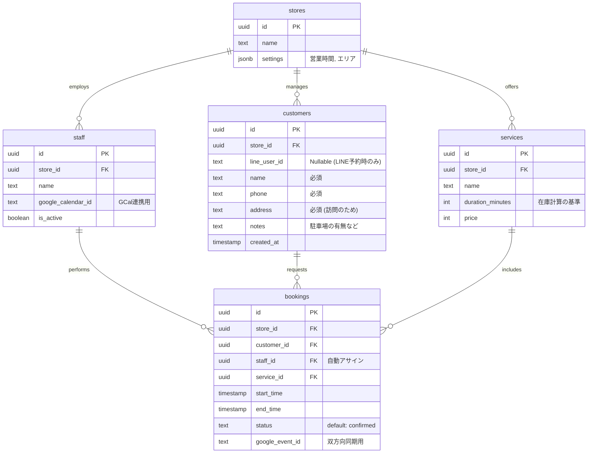

# Haukuri Pro: Phase 0 (MVP) "現場特化" 設計書

## 1. 結論サマリ
**「顧客管理(CRM)」と「スタッフ稼働管理(Resource)」を分離し、AI/決済を全廃します。**
現場が最も恐れるのは「ダブルブッキング」と「顧客連絡ミス」です。これを防ぐために、`auth.users` (ログインユーザー) への依存を排除し、電話予約などの「代理登録」を第一級市民として扱います。Googleカレンダー連携は「同期」ではなく「正(Master)への書き込み」として実装し、不整合をゼロにします。

---

## 2. アーキテクチャ差分 (Phase 0 で削るもの・残すもの)

### ❌ Phase 0 で削るもの (Delete)
*   **AI Booking Agent**: 現場はAIの不確実な対話を嫌います。固定フォーム入力で十分です。
*   **pgvector / Embeddings**: 顧客の「好み」より「住所と電話番号」が正確ならOKです。
*   **Stripe / Payment**: 現地現金決済や請求書払いがまだ多い業界です。まずは予約管理に集中します。
*   **Supabase Auth (Customer Side)**: 顧客に「アカウント作成」を強いると離脱します。LINEログイン(ID連携)のみで顧客特定し、非会員(電話予約)も許容します。
*   **Pending Status**: 調整コストを無くすため、空き枠のみ表示し「即予約確定(Confirmed)」とします。

### ✅ Phase 0 で必須なもの (Keep & Must)
*   **Staff Entity**: 「誰が」行くかが商品です。スタッフごとのカレンダー連携が必須です。
*   **Customers Entity**: `auth.users` とは独立した顧客台帳。電話予約の受け皿です。
*   **Unified Booking API**: 予約作成時に「在庫確認(GCal)」「顧客保存」「予約確定」「通知」を一気通貫で同期実行します。(非同期/Edge分割はリスク)
*   **API Gateway**: `src/app/api/bookings/route.ts` にロジックを集約します。

---

## 3. 修正版 ER図 (Phase 0)

`auth.users` への外部キー依存を `bookings` から外し、`customers` テーブルを新設します。

---

## 4. 予約フローの最適化 (即時確定モデル)

**なぜ Pending を使わないか？**
ダブルブッキングのリスクが残る期間を作りたくないためです。ユーザーが画面を見ているその瞬間に GCal をロックしに行きます。

1.  **空き枠検索**:
    *   指定日の `staff` 全員の Googleカレンダー予定を取得。
    *   `services.duration` が収まる隙間があるスタッフのみを抽出。
2.  **予約実行 (Atomic Operation)**:
    *   **Staff Assign**: 空いているスタッフを1名割り当て (Round-robin等)。
    *   **Customer Upsert**: 電話番号/LINE IDで既存客か判定、なければ新規作成。
    *   **GCal Insert**: 割り当てられたスタッフのカレンダーに予定書き込み (これが成功したら予約成立)。
    *   **DB Insert**: `bookings` に `confirmed` で保存。
3.  **完了通知**:
    *   LINE Messaging API で通知。

---

## 5. フェーズ別ロードマップ

| Phase | テーマ | 実装スコープ | 狙い |
| :--- | :--- | :--- | :--- |
| **Phase 0** | **現場稼働** | **予約管理、GCal連携、スタッフ管理、LINE通知** | **電話対応工数の削減、ダブルブッキング撲滅 (ARR 0→1000万)** |
| **Phase 1** | 顧客体験 | マイページ(Auth)、事前決済(Stripe)、来店前リマインド | キャンセル率の低下、LTV向上 (ARR →5000万) |
| **Phase 2** | 経営支援 | AI自動応答、売上分析、口コミ促進 | 経営の自動化、フランチャイズ展開支援 (ARR →1億超) |
