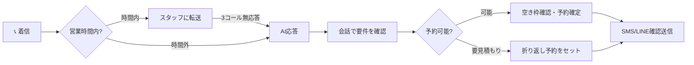
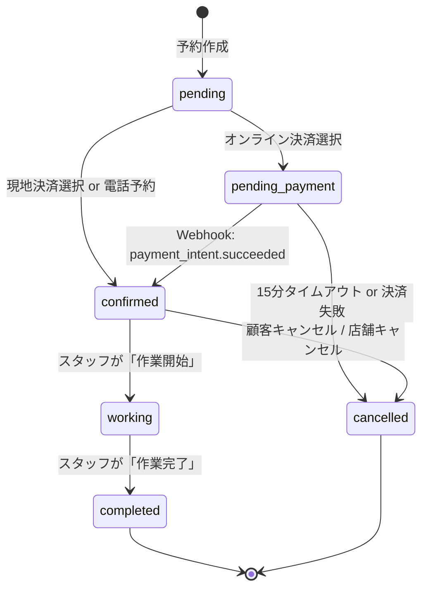

# Product Requirements Document（PRD）- Amber v1.1 Detail

> [!IMPORTANT]
> **Single Source of Truth (SSOT)**
> 本ドキュメントは Amber プロジェクトにおける「唯一の真実」である。
> 全てのコード実装、デザイン、外部連携、および AI エージェントへの指示は、本ドキュメントの定義を最上位の正解として参照・遵守しなければならない。
> 仕様の変更が必要な場合は、まず本ドキュメントを更新し、合意を得ることを必須とする。

## プロダクト名

Amber（アンバー）

---

## 1. 背景・目的（Background & Goal）

**「くらし」領域のフィールドサービス事業者のDXを推進し**、予約の自動化と顧客資産（住宅設備・作業履歴）の管理を通じたLTV（顧客生涯価値）最大化を目指す。

### 対象領域（競合「くらしのマーケット」と同一市場）

| カテゴリ | 主なサービス例 |
|:---|:---|
| **ハウスクリーニング** | エアコン清掃、キッチン・換気扇、浴室・トイレ、フロアコーティング |
| **リフォーム・修繕** | 壁紙張替、床・クロス張替、建具修理、外壁塗装、水回り工事 |
| **引越し・運搬** | 家庭引越し、単身引越し、家具移動、大型家電配送 |
| **不用品回収・片付け** | 粗大ゴミ回収、遺品整理、ゴミ屋敷清掃、物置整理 |
| **庭・外構** | 剪定・伐採、造園・ガーデニング、草刈り、外構工事 |
| **害虫駆除・診断** | シロアリ駆除、ハチ駆除、カビ除去、住宅診断 |
| **設備メンテナンス** | 給湯器交換、エコキュート設置、ソーラーパネル、蓄電池 |

> [!NOTE]
> **初期導入 → 横展開戦略**:
> 全国 **70店舗を展開する大手ハウスクリーニングフランチャイズ** への導入が決定。この実績を足がかりに、他の「くらし」領域に横展開していく。

---

## 2. 解決する課題と導入メリット（Problem & Benefit）

事業者が Amber を導入することで得られる具体的な価値を、現状の課題と対比して定義する。

### 2-1. 現状の課題（Pain Points）
*   **高額なプラットフォーム手数料**: 既存のマッチングプラットフォーム（くらしのマーケット、ユアマイスター、ミツモア等）では、売上の約 20〜25% という高額な手数料が発生しており、事業者の利益を著しく圧迫している。
*   **現場作業中の電話応答不可**: スタッフが現場作業中は電話に出られず、**新規予約の取りこぼし**が日常的に発生。折り返し電話をする頃には顧客が競合他社に流れてしまう。
*   **アナログ管理による機会損失**: 電話や紙メモ、LINE のやり取りのみで管理しているため、ダブルブッキングや転記ミス、予約の取りこぼしが発生している。
*   **属人的な顧客管理**: 過去の施工内容や、その家の設備情報（型番・設置日など）がスタッフの記憶に頼っており、担当者が変わると「前と同じで」という顧客の期待に応えられない。
*   **事務作業の肥大化**: 見積書の発行、請求書の送付、売上の集計、フランチャイズ本部への報告作業に膨大な時間が割かれ、現場の収益性が低下している。
*   **単発利用で終わる関係性**: 作業完了後のフォローアップが仕組み化されておらず、住宅設備が交換時期を迎えても他社に流出してしまう。

> [!WARNING]
> **「電話に出られない」問題の影響**:
> くらし領域のフィールドサービス業界では、新規予約の **60%以上が電話経由** と言われている。しかしスタッフは1日4〜6時間、高所作業や水まわり工事等の現場で手が離せず電話に出ることができない。この「取りこぼし」を解決することが、売上向上の最大のレバーとなる。

### 2-2. 導入メリット（Business Benefits）
*   **収益性の劇的な改善**:
    *   自社集客（LINE 予約など）を Amber で完結させることで、プラットフォーム手数料を **7%** に抑え、手残り利益を最大化する。
*   **成約率と稼働率の向上**:
    *   24時間365日止まらないオンライン予約により、これまで取りこぼしていた深夜・早朝の予約を確実に獲得する。
    *   AI 配置最適化（将来機能）により、スタッフの移動ロスを最小化し、1日の施工件数を最大化する。
*   **「家カルテ」による LTV の最大化**:
    *   住宅設備（エアコン、給湯器、水回り）の情報を資産化することで、適切なタイミングで清掃や交換を提案。
    *   「家の主治医」としてのポジションを確立し、リピート率を劇的に向上させる。
*   **経営の透明化と効率化**:
    *   全店舗の売上や集客経路がリアルタイムで可視化され、本部・店舗間の精算・報告業務が Stripe Connect 等の活用により自動化される。
*   **スタッフの即戦力化**:
    *   現場でスマホから「過去の施工写真」や「顧客のこだわり」を瞬時に確認できるため、新人で現場の信頼を損なわないサービス品質を維持できる。

---

## 3. プロダクト定義（Product Definition）

Amber は、マルチテナント対応の予約管理エンジンと、「家カルテ」と呼ばれる住宅設備・作業履歴管理CRMを統合した、**「くらし」領域のフィールドサービス事業者向けバーティカルSaaS**である。

> [!TIP]
> **競合との違い**:
> くらしのマーケット等のマッチングプラットフォームは「顧客と事業者をつなぐ」機能。Amber は「事業者の業務をDXする」ツール。事業者が自社の顧客を獲得・維持するためのインフラを提供する。

### 対象セグメント
1.  **フランチャイズ / 多店舗展開事業者**: 本部が全店舗を統括し、現場（各店舗）が実運用を行う大規模構造。
2.  **個人店 / 単一店舗事業者**: 経営者が現場も兼任し、シンプルに1店舗を運営する構造。
3.  **複合サービス事業者**: クリーニング＋リフォーム、引越し＋不用品回収など、複数サービスを提供する事業者。

### ベンチマーク ＆ 目標とすべき機能
世界最高水準の Field Service Management (FSM) ソフトウェアおよび AI ソリューションをベンチマークとし、将来的にはこれらの機能群を日本市場向けにローカライズ・進化させた形で Amber に統合していく。

#### 1. ServiceTitan (エンタープライズ FSM / 業界標準)
*   **Smart Dispatch & GPS**: AIがスタッフのスキル、現在地、交通状況を考慮し、最も利益率の高いスタッフを最適アサイン。
*   **Marketing Pro**: 購入履歴に基づいたセグメント配信、DM発送の完全自動化、電話番号ごとのROI計測。
*   **Sales Pro (Presentation Mode)**: 現場でカタログを見せながら「松・竹・梅」の提案（Good/Better/Best）を行い、その場で成約・署名。
*   **Pricebook Pro**: 最新の住宅設備カタログと連動した、写真・動画付きの価格表管理。
*   **Inventory & Fleet Management**: 車両在庫のリアルタイム把握と、資材補充の自動オーダー。
*   **Embedded Financing**: 現場でのローン申し込み・即時審査（GreenSky等との連携）。
*   **Payroll & Timesheet**: 作業時間とコミッションを自動計算し、給与処理を高度に自動化。

#### 2. Jobber (中小規模向け / 業務効率化)
*   **Online Quotes & Approvals**: 顧客がモバイル上で見積もりを承認・修正できるセルフサービス型フロー。
*   **Client Hub**: 顧客専用ポータル。過去の請求書、予約履歴、見積もり、支払いを一元管理。
*   **Jobber Cards & Instant Payouts**: 独自の決済カード発行と、売上の即時入金機能。
*   **Route Optimization**: 最も移動距離の短い訪問順を1クリックで生成。
*   **Batch Invoicing & Automated Follow-ups**: 数十件の請求書を一括送付し、未払い者へのリマインドを自動化。

#### 3. HouseCallPro (UI/UX ＆ 顧客体験)
*   **Google Local Services Ads Integration**: Google 検索からの直接予約連携。
*   **"On My Way" Texts & Live Tracking**: スタッフの出発通知と、地図上でのリアルタイム移動確認。
*   **Automated Review Management**: 作業完了通知と同時に、Google/Yelp等への口コミ依頼を自動送信。
*   **Flat Rate Price Book**: 複雑な計算を省いた固定料金制のカタログ管理。
*   **Pipeline Management**: リード（見込み客）から商談、成約までの進捗を視覚的に管理。

#### 4. Avoca AI / Netic (AI 搭載次世代型 FSM)
*   **AI Answering Service**: 自然言語理解（NLU）を用いた電話・SMSの24時間自動受付。
*   **Intelligent Conversational Intake**: 顧客との会話から、建物の種類、設備の不具合状況、緊急度を抽出し、FSMへ自動入力。
*   **Post-Call Summaries & Action Items**: 通話内容を要約し、スタッフが次にすべきアクションを自動生成。
*   **Proactive Retention**: 過去の利用データから、離脱リスクのある顧客をAIが特定し、パーソナライズされたクーポンを自動送信。

---

## 3-A. ユーザー・事業者ができること（Capability Matrix）

Amber を利用する全てのユーザーが「具体的に何ができるか」を網羅的に記載する。

### 顧客（エンドユーザー）ができること

| カテゴリ | 機能 | 説明 |
|:---|:---|:---|
| **予約** | オンライン予約 | 24時間365日、スマホ/PCから希望日時・サービスを選んで予約 |
| | サービス選択 | メニュー一覧から希望サービスを複数選択、オプション追加 |
| | 空き枠確認 | リアルタイムで予約可能な日時を確認 |
| | 担当スタッフ指名 | 指名料を払って特定スタッフを指名（任意） |
| | 予約変更・キャンセル | マイページから予約の日時変更・キャンセル |
| **決済** | オンライン事前決済 | クレジットカード/電子マネーで事前支払い |
| | 現地決済 | 作業完了後に現金/カードで現地支払い |
| | 領収書発行 | 決済完了後に電子領収書を自動受信 |
| **通知** | 予約確認通知 | 予約確定時にLINE/メールで詳細を受信 |
| | リマインド | 予約前日にリマインド通知を受信 |
| | スタッフ出発通知 | 作業当日「スタッフが向かっています」通知 |
| | 施工完了通知 | 作業完了後にサンキューメッセージ |
| **履歴・レビュー** | 過去の予約確認 | マイページで過去の予約履歴を確認 |
| | レビュー投稿 | 施工完了後にサービス評価・口コミ投稿 |

---

### 店舗スタッフ（現場）ができること

| カテゴリ | 機能 | 説明 |
|:---|:---|:---|
| **スケジュール** | 本日の予約確認 | アプリで当日の予約一覧・ルートを確認 |
| | 担当予約詳細 | 顧客情報、住所、過去履歴、特記事項を確認 |
| | ステータス更新 | 「作業開始」「作業完了」をワンタップで記録 |
| **顧客対応** | 過去の施工写真確認 | 同じ顧客の過去の施工写真・メモを確認 |
| | 顧客メモ登録 | 作業中の気づき、注意点をメモとして記録 |
| | 施工写真撮影 | 施工前後の写真を撮影して記録 |
| **オフライン** | オフライン閲覧 | 電波の悪い現場でもキャッシュされた予約情報を閲覧 |
| | オフライン記録 | メモ・写真をオフラインで保存、後から同期 |

---

### 店長・店舗管理者ができること

| カテゴリ | 機能 | 説明 |
|:---|:---|:---|
| **予約管理** | 予約一覧・カレンダー | 全予約を一覧/カレンダー形式で閲覧 |
| | 予約手動登録 | 電話受付分を管理画面から手動登録 |
| | 予約変更・キャンセル | 顧客都合・店舗都合での予約変更・キャンセル処理 |
| | スタッフアサイン | 予約に対してスタッフを手動割り当て |
| **スタッフ管理** | スタッフ登録・編集 | スタッフの追加、プロフィール編集、指名料設定 |
| | シフト・スケジュール | スタッフの出勤日・時間帯を設定 |
| | 休暇・特別シフト | 特定日の休暇・時間変更を登録 |
| **メニュー管理** | サービス登録・編集 | 提供サービスの名称、価格、所要時間、説明を設定 |
| | オプション設定 | サービスに追加できるオプション（コーティング等）を設定 |
| | サービスON/OFF | 一時的にサービスを非公開にする |
| **顧客管理** | 顧客一覧・検索 | 電話番号・名前で顧客を検索 |
| | 顧客詳細・履歴 | 特定顧客の全予約履歴、累計利用額を確認 |
| | 顧客メモ編集 | 顧客ごとの特記事項（こだわり、注意点）を編集 |
| **売上・分析** | 日次・月次売上 | 期間別の売上推移を確認 |
| | メニュー別売上 | どのサービスが売れているかを分析 |
| | スタッフ別売上 | スタッフごとの売上・施工件数を比較 |
| | 予約チャネル分析 | Web/LINE/電話など流入元を確認 |
| **設定** | 営業時間設定 | 曜日ごとの営業開始・終了時間を設定 |
| | 対応エリア設定 | サービス提供可能な地域（市区町村）を設定 |
| | 決済設定 | Stripe連携、事前決済/現地決済の選択 |
| **通知・フォロー** | 不在着信リスト | 出られなかった電話のリストと折り返し状況 |
| | SMS自動送信結果 | 自動送信したSMSの履歴、予約転換率 |
| | レビュー依頼 | 顧客へのレビュー依頼を手動送信 |

---

### フランチャイズ本部ができること

| カテゴリ | 機能 | 説明 |
|:---|:---|:---|
| **店舗管理** | 店舗一覧 | 全加盟店のリストと基本情報を閲覧 |
| | 店舗追加・編集 | 新規店舗の開設、既存店舗情報の編集 |
| | 店舗別設定 | 店舗ごとのプラン・機能制限を設定 |
| **横断分析** | 全店舗売上ダッシュボード | 全店舗の売上を一括で可視化 |
| | 店舗ランキング | 売上・予約数・顧客満足度で店舗を比較 |
| | 地域別需要ヒートマップ | どの地域に需要があるかを可視化 |
| | LTV分析 | 顧客の生涯価値（累計支出額）を分析 |
| **請求・精算** | 月次請求管理 | 各店舗への月額利用料＋手数料の請求管理 |
| | 請求書発行 | PDFでの請求書自動生成・送付 |
| | 入金確認 | 店舗からの入金ステータス管理 |
| **ユーザー管理** | 管理者追加 | 店舗管理者アカウントの発行・権限設定 |
| | ロール・権限管理 | Super Admin / Store Admin / Staff のロール付与 |
| **運用支援** | サポートチケット | 加盟店からの問い合わせ管理（将来） |

---

## 4. 機能要件：詳細仕様（Functional Requirements）

実装時のミスを防ぐため、各機能のデータ定義およびロジック仕様を具体化する。

### 4-1. 予約管理

予約の重複（ダブルブッキング）を物理的に防ぐ

#### A. 予約ステータス ＆ チャネル定義
実装のブレを避けるため、以下の列挙値を標準とする。
*   **予約ステータス (`bookings.status`)**:
    *   `pending`: 予約受付済み（決済前・承認前の初期状態）
    *   `pending_payment`: オンライン決済待ち（Stripe Webhook待ち）
    *   `confirmed`: 確定（スタッフ・枠が確保された状態）
    *   `working`: 作業中（スタッフが現場で施工中）
    *   `completed`: 施工完了
    *   `cancelled`: キャンセル（返金処理含む）
*   **集客チャネル (`bookings.channel`)**:
    *   `web`: 公式予約サイト
    *   `line`: LINE公式アカウント
    *   `phone`: 電話受付（管理画面入力）

#### B. 空き枠計算ロジックの定義
*   **入力パラメータ**: 店舗ID, サービスID, スタッフID（任意）, 希望日。
*   **計算プロセス**:
    1.  **店舗営業時間**: `stores.business_hours` (Asia/Tokyo) から取得。「毎週月曜9:00-18:00」等の概念的なローカル時刻として扱う。
    2.  **スタッフシフト ＆ 予約**: `shifts` および `bookings` の `start_at / end_at` (**timestamptz / UTC**) を突き合わせ。
    3.  **既存予約**: `status <> 'cancelled'` の全予約（決済待ちを含む）を取得。
    4.  **所要時間**: サービスの `duration_minutes` 合計。
    5.  **スロット生成**: 30分間隔で重なりを判定。

> [!IMPORTANT]
> **予約重複防止の最終仕様 (Technical Truth)**:
> 予約の競合（ダブルブッキング）は、アプリケーション層のチェックだけでなく、**データベース側の `EXCLUDE` 制約（`gist` インデックスを用いた `tsrange` 重なり検知）** を最終防波堤として物理的に 100% 排除する。

> [!IMPORTANT]
> **決済待ち（pending_payment）の仮押さえ ＆ TTL ルール**:
> - **占有単位**: `pending_payment` は **`staff_id` 単位** でスロットを占有する。スタッフ指名なしの場合、作成時にシステムが空きスタッフを 1 名自動選定し `staff_id` を仮確定する（Phase 1.1 では後から変更しない）。
> - **有効期限 (TTL)**: 決済待ちの有効期限は `bookings.expires_at` (**timestamptz**) に保存し、**15分間（一律）** とする。
> - **自動キャンセル**: サーバ側の定期ジョブ（1分間隔）で期限超過を監視し、自動的に `cancelled`（`cancellation_reason: 'payment_timeout'`）へ更新する。
> - **二重防波堤**: `confirmed` への遷移（Webhook受取時等）において、アプリ側でも `expires_at` を再検証し、期限切れの場合は確定を拒否する。
> - **DB実装要件**: `bookings` テーブルに `expires_at timestamptz` および `cancellation_reason text` カラムを追加すること。

> [!IMPORTANT]
> **Phase 1.1 における非対応（スコープ外）事項**:
> - **深夜営業**: 日を跨ぐ営業（例: 22:00 - 02:00）は Phase 1.1 では非対応とする。営業開始・終了およびスタッフシフトは同一日内で完結することを前提とする。
> - **移動バッファ**: 移動時間は考慮せず、予約枠は連続して埋める。
> - **複数人アサイン**: 1予約 = 1スタッフ。

#### C. 予約フロー（1ページ完結）
1.  **サービス選択**: `is_active=true` のサービスを表示。オプション選択による金額・所要時間の加算。
2.  **スタッフ選択**: 「指名なし」または、当該店舗に紐づくスタッフ（`staff_stores`）を選択。
3.  **日時選択**: 上記ロジックで算出された有効なスロットのみを表示。
4.  **顧客情報入力**: 名前、電話、メール、住所。
*各セクションは同一ページ内に順次表示、またはスクロールでアクセス可能とする。*

#### D. キャンセル ＆ 返金ポリシー

予約キャンセル時のルールを明確化し、トラブルを防止する。

*   **キャンセル期限 ＆ 料金**:
    *   予約日 **48時間前まで**: 無料キャンセル（全額返金）
    *   予約日 **24〜48時間前**: キャンセル料 **30%**
    *   予約日 **24時間以内**: キャンセル料 **50%**
    *   予約日 **当日**: キャンセル料 **100%**（返金なし）
*   **キャンセル主体別フロー**:
    *   `customer`: 顧客自身がキャンセル → 上記ルールに従い自動返金処理
    *   `store`: 店舗都合でキャンセル → **全額返金**（店舗への課金は発生しない）
    *   `system`: システムによる自動キャンセル（決済タイムアウト等）→ 返金不要（課金前のため）
*   **ノーショー対応**:
    *   予約時刻を **30分経過** しても来店なし → スタッフが `no_show` フラグを設定
    *   `no_show` 時は **キャンセル料 100%** として処理（返金なし）
*   **返金処理**:
    *   Stripe Refund API を使用し、元の決済手段へ返金
    *   返金処理は `bookings.refund_amount` と `refund_at` に記録

> [!NOTE]
> **店舗別カスタマイズ**: 上記はデフォルトポリシーであり、各店舗は `stores.cancellation_policy` (JSONB) で独自のルールを設定可能（Phase 1.2）。

---

### 4-2. 顧客管理 ＆ 訪問履歴（CRM）

「顧客が過去に何を依頼したか」を即座に把握し、精度の高い接客と再提案を可能にする。

#### A. 顧客（Customer）の定義とスコープ
*   **店舗単位の管理**: 顧客情報は **Store（店舗）単位で管理** される。同一組織内の別店舗には共有されない。
*   **ユニークキー**: `(store_id, phone)` の複合一意制約を採用。
*   **拡張性**: 将来的な名寄せ精度向上のため、`email`, `normalized_phone`, `external_ids` を保持。

#### B. 顧客台帳 ＆ オーダー履歴
*   **一元管理**: 名前、電話番号、メール、住所、および紐づく全予約データ。
*   **履歴詳細**: 過去の全予約における「利用メニュー」「オプション」「担当スタッフ」「合計金額（当時値）」「備考」を表示。
*   **集計データ**: 累計利用回数、最終利用日、LTV（累計売上）を自動計算。

#### C. 住宅設備管理「家カルテ」（Future / Phase 2）
*   **設備情報**: メーカー・型番、設置日、劣化状態、前回清掃状況の記録。
*   **プッシュ提案**: 設置時期からの経過年数に基づく自動提案（メンテナンス・交換提案）。

---

### 4-4. 通知 ＆ コミュニケーション（Notifications）

顧客・スタッフへの適切なタイミングでの通知により、予約確認ミスや無断キャンセルを防止する。

#### A. 通知チャネルと優先順位
1. **LINE通知** (Growth/Enterprise プラン): LINE公式アカウント連携時、最優先で使用
2. **メール通知**: LINE未連携時、または重要通知の二重送信
3. **SMS通知** (Phase 2): 緊急連絡・リマインドの最終手段

#### B. 顧客向け通知タイミング

| タイミング | 通知内容 | チャネル | 必須/任意 |
|:---|:---|:---|:---:|
| 予約確定時 | 予約詳細、日時、担当スタッフ、料金 | LINE/メール | 必須 |
| 予約変更時 | 変更内容の差分、新しい日時 | LINE/メール | 必須 |
| 予約キャンセル時 | キャンセル確認、返金情報 | LINE/メール | 必須 |
| **前日リマインド** | 明日の予約確認、住所・時刻 | LINE/メール | 必須 |
| **当日「向かっています」** | スタッフ出発通知、到着予定時刻 | LINE | 任意 |
| 施工完了後 | サンキューメッセージ、レビュー依頼リンク | LINE/メール | 必須 |
| 決済完了時 | 領収書、明細 | メール | 必須 |

#### C. スタッフ向け通知

| タイミング | 通知内容 | チャネル |
|:---|:---|:---|
| 新規予約割り当て時 | 予約詳細、顧客情報、過去履歴 | アプリPush/メール |
| 予約変更・キャンセル時 | 変更内容 | アプリPush |
| 当日スケジュール | 本日の予約一覧（朝7:00配信） | アプリPush/メール |

#### D. 通知テンプレート例（LINE Flex Message）

```json
{
  "type": "bubble",
  "header": { "type": "box", "contents": [{ "type": "text", "text": "ご予約確定" }] },
  "body": {
    "type": "box",
    "contents": [
      { "type": "text", "text": "エアコンクリーニング", "weight": "bold" },
      { "type": "text", "text": "2025年1月15日（水）10:00〜" },
      { "type": "text", "text": "担当: 山田太郎" }
    ]
  },
  "footer": {
    "type": "box",
    "contents": [{ "type": "button", "action": { "type": "uri", "label": "予約詳細", "uri": "https://..." } }]
  }
}
```

#### E. フォールバック戦略

- **LINE API障害時**: 自動的にメール通知へ切り替え
- **メール配信失敗時**: 3回リトライ後、管理画面に警告表示
- **通知未達の検知**: 開封率トラッキング（LINE既読/メールOpen率）、未読リストを管理画面に表示

---

### 4-5. スマート着信対応（Smart Call Handling）

現場作業中に電話に出られない問題を解決し、**予約の取りこぼしをゼロ**にする。

> [!IMPORTANT]
> **ビジネスインパクト**: ハウスクリーニング業界では新規予約の60%以上が電話経由。スタッフが1日4〜6時間作業中に出られない電話を自動対応することで、**売上20〜30%向上**が見込める。

#### A. Phase 1.2: スマートSMS自動返信（Immediate Solution）

電話に出られなかった場合、即座にSMSで予約リンクを自動送信する。

| トリガー | アクション | 内容 |
|:---|:---|:---|
| 不在着信（3コール無応答） | SMS自動送信 | 「お電話ありがとうございます。ただいま作業中のためお電話に出られません。こちらから24時間ご予約いただけます → [予約URL]」 |
| 営業時間外着信 | SMS自動送信 | 「営業時間外のためお電話に出られません。オンラインで24時間ご予約可能です → [予約URL]」 |

*   **実装方式**: Twilio / SMSAPI を使用した自動発信
*   **コスト**: 1通あたり約¥8〜15（国内SMS）
*   **着信検知**: 店舗の転送設定 or VoIPゲートウェイ経由

#### B. Phase 1.2: 不在着信ダッシュボード

管理画面に「折り返し待ちリスト」を表示し、作業終了後に効率的に対応できるようにする。

```
┌─────────────────────────────────────────────────────────────┐
│ 📞 不在着信リスト                           今日 5件  │
├─────────────────────────────────────────────────────────────┤
│ ⏰ 10:32  090-xxxx-1234  SMS送信済 ✅  未予約     [電話]   │
│ ⏰ 11:15  080-xxxx-5678  SMS送信済 ✅  予約済 🎉  [詳細]   │
│ ⏰ 14:08  070-xxxx-9012  SMS送信済 ✅  未予約     [電話]   │
│ ⏰ 15:30  090-xxxx-3456  既存顧客 👤  未予約     [電話]   │
│ ⏰ 16:45  080-xxxx-7890  新規 🆕      未予約     [電話]   │
└─────────────────────────────────────────────────────────────┘
```

*   **既存顧客マッチング**: 電話番号で `customers` テーブルを検索し、既存顧客かどうかを表示
*   **予約コンバージョン追跡**: SMS送信後に予約が入ったかを自動追跡
*   **ワンタップ発信**: 管理画面から直接折り返し電話

#### C. Phase 2.0: AI電話応答エージェント（Future）

**24時間365日、AIが電話を受け取り、予約を完結させる。**



*   **技術スタック**: Twilio Flex + OpenAI Realtime Voice API / Retell AI / VAPI
*   **対話例**:
    ```
    AI: 「〇〇クリーニングです。本日はどのようなご用件でしょうか？」
    顧客: 「エアコン掃除をお願いしたいんですけど」
    AI: 「エアコンクリーニングですね。何台のエアコンをご希望ですか？」
    顧客: 「2台です」
    AI: 「2台ですね。来週の土曜日10時からご都合いかがでしょうか？」
    顧客: 「大丈夫です」
    AI: 「ご予約を確定しました。詳細はSMSでお送りします。」
    ```

*   **フォールバック**: 複雑な質問（見積もり詳細等）は人間のスタッフに折り返し予約をセット

#### D. 効果測定 KPI

| 指標 | Phase 1.2目標 | Phase 2.0目標 |
|:---|:---:|:---:|
| 不在着信からの予約転換率 | 15% | 40% |
| 折り返し電話 → 予約成約率 | 50% | N/A（AI完結） |
| 平均折り返し時間 | 2時間以内 | 即時（AI応答） |
| 取りこぼし件数/月 | 50%減 | 90%減 |

---

### 4-3. マルチテナント管理（Multi-tenancy）

組織間のデータ独立性とセキュリティを担保し、フランチャイズ本部と加盟店の「共存」を実現する。

#### A. 階層構造と独立性
1.  **Organizations (組織/本部)**: 最上位。Stripe契約単位。加盟店全体を統括。
    *   **役割**: **分析および収益回収の主体。** 各店舗の売上の集計、手数料の徴収、プラットフォーム全体のガバナンスを担う。実業務（予約の履行）の主体ではない。
2.  **Stores (店舗/加盟店)**: 実際のサービス提供拠点。URL Slugを持つ。
    *   **役割**: **Booking（予約）の唯一の所有権を持つ実行主体。** 自店舗のスタッフ、メニュー、スケジュールを管理し、サービスを提供する。
    *   **独立性**: 各店舗は専用のメニュー（価格・所要時間）、スタッフ、営業時間を持ち、自店舗の売上・顧客情報を独立して管理する。
3.  **Profiles (スタッフ/管理者)**: 特定のOrganizationに所属。`role`（admin, staff）による権限分離。

#### B. セキュリティルール (RLS)
*   **組織内隔離**: 他の Organization のデータは一切参照不可。
*   **店舗所属モデル**: ユーザーの所属店舗は **`profiles_stores`（中間テーブル）** によって管理・制御される。
*   **店舗内限定（Store Admin）**: 自身の所属・担当する `store_id` に紐づくデータ（予約、売上、メニュー、スタッフ）のみ操作可能。
*   **本部横断（Super Admin）**: 同一 Organization 内の全 `store_id` のデータを操作可能。

---

## 5. 収益モデル ＆ 決済設計（Revenue Model）

### 5-1. 料金体系
*   **固定月額**: 選択した料金プラン（第6章参照）に基づく月額費用。
*   **プラットフォーム利用料 (成果報酬)**: Stripe を経由した **オンライン決済売上(GMV) の 7%** を徴収。
    *   *※重要: 「現地決済（現金払い）」等の Stripe を介さない取引は 7% 徴収の対象外とする（将来的な自己申告ベースの徴収検討）。*

### 5-2. 課金モデル（Billing Model）
本部が各店舗に対して月次請求を行う方式を採用する。

*   **月次請求方式**: 本部（プラットフォーム運営）が各店舗に対して月額利用料＋プラットフォーム手数料を請求。
*   **請求内容**: 
    1.  固定月額利用料（プラン別）
    2.  GMV×7% のプラットフォーム利用料
*   **決済フロー**: 店舗が顧客から直接決済を受け取り、本部が後から手数料を請求。

> [!IMPORTANT]
> **「一括弴収して分配」ではない**:
> 店舗の売上を本部が一括弴収してから分配するモデルではなく、各店舗が直接決済を受け取り、本部が別途請求する方式。

*   **返金・トラブル時の責任**:
    *   返金資金の確保、およびチャージバック発生時の損失負担は、店舗が負うものとする。

## 6. 料金プラン ＆ 機能制限（Pricing Plans & Limits）

事業者の規模とフェーズに応じて、利用可能な機能や容量（店舗数・スタッフ数・家カルテ登録数）を制限するプラン体系を導入する。

| プラン名 | ターゲット | 月額費用 | 主な制限 / 利用枠 | 解放される機能 |
| :--- | :--- | :--- | :--- | :--- |
| **Starter** | 個人事業主・テスト導入 | **¥0** / 月 | 店舗数: 1<br>スタッフ: 3名まで<br>家カルテ: 50件 | オンライン予約、カレンダー管理、Stripe決済連携（基本） |
| **Growth** | 成長中の店舗・複数展開店 | **¥9,800** / 月 | 店舗数: 3<br>スタッフ: 無制限<br>家カルテ: 500件 | LINE通知・自動リマインド、詳細分析ダッシュボード |
| **Enterprise** | 大手FC・ホールディングス | **個別見積もり** | 店舗数: 無制限<br>スタッフ: 無制限<br>家カルテ: 無制限 | 本部一括管理、AI 予約代行 (Phase 2)、優先サポート、データ一括出力 |

> [!IMPORTANT]
> **全てのプランに共通する費用**:
> 上記の月額システム利用料とは別に、**Stripe を経由した決済取引に対して 7% のプラットフォーム利用料**が発生する。

> [!NOTE]
> **超過料金**: プランごとの「家カルテ（住宅設備）」登録数を超過する場合、1件あたり ¥50/月 程度の従量課金、または上位プランへの移行を促す。

### 6-1. プラン別機能・容量一覧（Feature Matrix）

| 機能・リソース | Starter | Growth | Enterprise |
| :--- | :---: | :---: | :---: |
| **最大店舗数** | 1 | 3 | 無制限 |
| **最大スタッフ数** | 3 | 無制限 | 無制限 |
| **家カルテ登録数** | 50 | 500 | 無制限 |
| **オンライン予約・決済** | ◯ | ◯ | ◯ |
| **売上の 7% 手数料** | ◯ | ◯ | ◯ |
| **LINE 通知・リマインド** | ✖ | ◯ | ◯ |
| **詳細分析・経営ダッシュボード** | ✖ | ◯ | ◯ |
| **Google カレンダー同期** | ✖ | ◯ | ◯ |
| **AI 予約代行 (Phase 2)** | ✖ | ✖ | ◯ |
| **本部一括管理・分析** | ✖ | ✖ | ◯ |

### 6-2. プラン別制限 ＆ ダウングレード戦略
| プラン | 店舗数上限 | スタッフ数 | 家カルテ | 特徴 |
| :--- | :--- | :--- | :--- | :--- |
| **Starter** | 1店舗 | 3名まで | ❌ | 個人店・スモールスタート向。 |
| **Growth** | 5店舗 | 無制限 | ⭕ | 複数拠点を展開する成長企業向。 |
| **Enterprise** | 無制限 | 無制限 | ⭕ | 大手フランチャイズ・10店舗以上。 |

> [!TIP]
> **ダウングレード時の挙動 (Soft-limit Strategy)**:
> 上位プランから下位へ変更された場合、**既存データ（超過した店舗や家カルテ）は削除せず、新規作成のみをブロック** する。14日間の猶予期間を設け、その間にユーザーがデータを整理することを促す仕様とする。

### 6-3. 機能制限の実装方針（Hybrid Access Control Strategy）

プランによる制限は、セキュリティと UX（ユーザー体験）を両立させるため、モダンな SaaS ベストプラクティスである「ハイブリッド・アクセス制御」を採用する。

#### A. アプリケーション層（メイン・ガード ＆ 誘導）
リソースの作成や機能実行の直前に、アプリケーションロジック（API）で制限をチェックする。
- **実装方法**: API 処理内で現在のリソース数をカウントし、上限に達している場合は **「プラン上限に達しました。ここからアップグレードして制限を解除しましょう」** という趣旨の JSON エラーを返す。
- **効果**: ユーザーに「なぜ失敗したか」を親切に伝え、スムーズに決済ページへ誘導（PLG 実装）できる。

#### B. データベース層（構成とデータの整合性）
DB は「強制」ではなく「構成（Entitlements）」の保持に特化させる。
- **実装方法**: `organizations` テーブルに `plan_type` および各制限値（`max_stores` 等）を保存。複雑なトリガーによるエラー停止は避け、アプリケーション層での柔軟な制御を可能にする。
- **効果**: 「キャンペーン期間中だけ特別に上限を増やす」などの施策が、DB スキーマの変更なしに設定値の更新だけで対応可能になる。

#### C. フロントエンド層（Feature Flag / UX）
ユーザーのプランに応じて、利用可能な機能を動的に制御する。
- **実装方法**: `usePermission` フックや `FeatureGate` コンポーネントを用い、未契約機能に「Proプラン」ラベルを表示したり、モーダルでアップグレードを促す。
- **効果**: ユーザーが自然と上位プランの価値を理解し、自己解決型でアップグレードを行う流れを作る。

#### D. Stripe Entitlements への対応（将来性）
将来的に Stripe の Entitlements API と同期することで、決済ステータス（支払い遅延による機能停止など）とアプリケーションの機能をリアルタイムかつセキュアに連動させる。

---

## 7. 権限階層 ＆ 権限管理（ACL）

### 7-1. スタッフとプロファイルの関係性
*   **Profiles (Auth)**: ログイン認証を持つユーザー。
*   **Staff (実体)**: 名前、指名料、Googleカレンダー同期等の設定を持つ実体。
*   **紐付け**: `staff.profile_id` (nullable) を通じて 1:1 または 1:0 (ログインしない現場作業員) の関係を構成。

### 7-2. ロール別権限
| ロール | 権限範囲 | 利用シーン |
| :--- | :--- | :--- |
| **Super Admin** | 組織内の全店舗の全データにアクセス。店舗開設。 | 本部。 |
| **Store Admin** | 自店舗のメニュー、予約、スタッフ、売上管理。 | 店長。 |
| **Field Staff** | 自身が担当する予約の閲覧、現場メモ・写真登録。 | 現場。 |

---

## 8. 分析 ＆ 経営改善ダッシュボード（Analytics & Insights）

データに基づいた経営判断を支援し、店舗の収益性と作業効率を最大化するための可視化エンジンを搭載する。

### 8-1. 主要可視化指標 (Core KPIs) ＆ 計測イベント
分析ダッシュボードの精度を担保するため、以下のイベントログをトリガーに計測を行う。

1.  **売上 ＆ 収益性**:
    - **Total Revenue (日次/月次)**: 店舗別、メニュー別、スタッフ別の売上推移。
    - **Average Ticket Price (客単価)**: オプション購入率と連動した単価向上の可視化。
    - **Profit Margin (純利益)**: プラットフォーム手数料抜きの実質手残り。
    - *計測イベント: `payment_success`, `booking_confirmed`*
2.  **集客 ＆ 予約効率**:
    - **Conversion Rate (CVR)**: 予約フォームのプレビュー数 vs 予約完了数。
    - **Channel Mix (集客経路)**: LINE, 自社Web, 電話, マッチングサイト等の流入元特定。
    - *計測イベント: `view_booking_form`, `submit_booking`*
3.  **現場稼働 ＆ 品質**:
    - **Staff Utilization (スタッフ稼働率)**: 就業時間に対する作業時間の割合。
    - **Cancellation Rate (キャンセル率)**: 直前キャンセルの傾向。
    - *計測イベント: `booking_cancelled`*

### 8-2. フランチャイズ本部向け機能 (HQ Aggregation)
- **店舗ランキング**: 売上、集客効率、顧客満足度による店舗比較。
- **地域別需要ヒートマップ**: 出店戦略に活用。
- **LTV (顧客生涯価値)**: 1顧客の初回訪問から現在までの累計支出額。
- **Retention / Churn**: 定期サービスの継続率と離脱時期の特定。

---

## 9. データモデル・エンティティ（Data Schema Summary）

### 9-1. 主要テーブル定義

> [!IMPORTANT]
> **実装ステータス凡例**: ✅ = 実装済み、🔧 = 要マイグレーション（スキーマ変更必要）

| テーブル名 | 役割 | 主要カラム | 状態 |
| :--- | :--- | :--- | :---: |
| `organizations` | 組織 | `slug`, `plan_type`, `entitlements` (JSONB) | ✅ |
| `stores` | 店舗 | `organization_id`, `business_hours` (JSONB), `slug`, `cancellation_policy` (JSONB) | 🔧 |
| `profiles` | ユーザー | `role`, `organization_id` | ✅ |
| `staff` | スタッフ実体 | `organization_id`, `profile_id` (NULL可), `name`, `nomination_fee` | ✅ |
| `staff_stores` | スタッフ-店舗紐付 | `staff_id`, `store_id` | ✅ |
| `profiles_stores` | ユーザー-店舗紐付 | `profile_id`, `store_id`, `role` | 🔧 |
| `customers` | 顧客マスタ | `store_id`, `phone`, `email`, `normalized_phone` | 🔧 |
| `services` | メニュー | `store_id`, `duration_minutes`, `price` | ✅ |
| `bookings` | 予約 | `org_id`, `store_id`, `status`, `start_time`, `expires_at`, `cancellation_reason` | 🔧 |
| `booking_items` | 予約明細 | `booking_id`, `service_id`, `quantity`, `unit_price`, `snapshot_duration` | 🔧 |
| `house_assets` | 住宅設備 | `organization_id`, `customer_id`, `asset_category`, `asset_data` (JSONB) | 🔧 |
| `invoices` | 請求 | `booking_id`, `organization_id`, `amount`, `status` | ✅ |
| `payment_events` | 決済イベント | `stripe_event_id` (Unique), `booking_id`, `event_type` | 🔧 |

### 9-2. 要マイグレーション テーブル詳細

#### A. `customers` テーブル（顧客マスタ）

顧客情報は**店舗単位で管理**される。同一組織内でも別店舗には共有されない。

```sql
CREATE TABLE customers (
  id UUID DEFAULT uuid_generate_v4() PRIMARY KEY,
  store_id UUID REFERENCES stores(id) ON DELETE CASCADE NOT NULL,
  phone TEXT NOT NULL,
  normalized_phone TEXT, -- E.164形式
  email TEXT,
  full_name TEXT,
  address TEXT,
  notes TEXT,
  total_visits INTEGER DEFAULT 0,
  total_spent INTEGER DEFAULT 0,
  last_visit_at TIMESTAMPTZ,
  created_at TIMESTAMPTZ DEFAULT NOW(),
  UNIQUE(store_id, phone)
);
```

#### B. `booking_items` テーブル（予約明細）

1予約に複数サービスを紐付けるための明細テーブル。現在は `bookings.service_id` で1:1だが、将来的なセット予約に対応。

```sql
CREATE TABLE booking_items (
  id UUID DEFAULT uuid_generate_v4() PRIMARY KEY,
  booking_id UUID REFERENCES bookings(id) ON DELETE CASCADE NOT NULL,
  service_id UUID REFERENCES services(id) NOT NULL,
  quantity INTEGER DEFAULT 1,
  unit_price INTEGER NOT NULL, -- 予約時点の価格スナップショット
  snapshot_duration INTEGER NOT NULL, -- 予約時点の所要時間
  created_at TIMESTAMPTZ DEFAULT NOW()
);
```

#### C. `profiles_stores` テーブル（ユーザー-店舗紐付）

`staff_stores` とは別に、管理者（Store Admin）の店舗アクセス権を管理。

```sql
CREATE TABLE profiles_stores (
  id UUID DEFAULT uuid_generate_v4() PRIMARY KEY,
  profile_id UUID REFERENCES profiles(id) ON DELETE CASCADE NOT NULL,
  store_id UUID REFERENCES stores(id) ON DELETE CASCADE NOT NULL,
  role TEXT CHECK (role IN ('admin', 'viewer')) DEFAULT 'admin',
  created_at TIMESTAMPTZ DEFAULT NOW(),
  UNIQUE(profile_id, store_id)
);
```

### 9-3. テクニカル設計指針
- **マルチテナント性能**: 全主要テーブルに `organization_id` を冗長的に保持。`idx_bookings_org_store_date` 等の複合インデックスにより、35万行/月以上の負荷でも P95 < 200ms を維持。
- **家カルテ（Asset Schema）**: `asset_data` (JSONB) にメーカー、型番、設置日、現在状態スコア、予測故障日、メンテナンス履歴を時系列で構造化して保持。
- **分析の高速化**: 本部横断レポート用に `mv_daily_store_stats` などのマテリアライズドビューを活用。
- **Webhook冪等性**: `payment_events` テーブルに `stripe_event_id` (Unique) を保持し、同一イベントの二重処理を防止。

> [!NOTE]
> **API仕様への参照**: 各エンドポイントの詳細は [api_spec.md](file:///Users/ayumu/Amber-House-PJ/docs/api_spec.md) を参照のこと。

---

## 10. 実装詳細仕様（Implementation Details）

エンジニアが迷わず実装できるよう、API、画面、状態遷移、バリデーション等を具体化する。

### 10-1. APIエンドポイント一覧

ベースURL: `/api`

#### 公開API（認証不要）

| エンドポイント | メソッド | 説明 |
|:---|:---:|:---|
| `/api/stores/public/:slug` | GET | 店舗公開情報取得（予約フォーム用） |
| `/api/services/public/:storeId` | GET | サービス一覧取得 |
| `/api/availability` | POST | 空き枠照会 |
| `/api/bookings` | POST | 予約作成（RPC経由） |
| `/api/checkout/session` | POST | Stripe Checkout Session作成 |

#### 管理API（Store Admin以上）

| エンドポイント | メソッド | 説明 |
|:---|:---:|:---|
| `/api/bookings` | GET | 予約一覧取得（フィルタ対応） |
| `/api/bookings/:id` | GET | 予約詳細取得 |
| `/api/bookings/:id` | PUT | 予約更新（ステータス変更等） |
| `/api/bookings/:id` | DELETE | 予約キャンセル |
| `/api/services` | GET | サービス一覧（管理用） |
| `/api/services` | POST | サービス作成 |
| `/api/services/:id` | PUT | サービス更新 |
| `/api/services/:id` | DELETE | サービス削除 |
| `/api/services/options` | GET/POST | オプションCRUD |
| `/api/staff` | GET | スタッフ一覧 |
| `/api/staff` | POST | スタッフ作成 |
| `/api/staff/:id` | PUT | スタッフ更新 |
| `/api/staff/:id` | DELETE | スタッフ削除（論理削除） |
| `/api/customers` | GET | 顧客一覧・検索 |
| `/api/customers/:id` | GET | 顧客詳細（履歴含む） |
| `/api/customers/:id` | PUT | 顧客情報更新 |
| `/api/stores` | GET | 店舗一覧 |
| `/api/stores/:id` | PUT | 店舗設定更新 |
| `/api/settings` | GET/PUT | 店舗設定一括 |
| `/api/admin/stats` | GET | ダッシュボード統計 |
| `/api/admin/plan/usage` | GET | プラン使用状況 |

#### 本部API（Super Admin）

| エンドポイント | メソッド | 説明 |
|:---|:---:|:---|
| `/api/hq/stores` | GET | 全店舗一覧 |
| `/api/hq/stores` | POST | 新規店舗作成 |
| `/api/hq/analytics` | GET | 全店舗横断分析 |
| `/api/hq/billing` | GET | 請求管理 |

#### Webhook/Cron

| エンドポイント | メソッド | 説明 |
|:---|:---:|:---|
| `/api/webhooks/stripe` | POST | Stripe Webhook受信 |
| `/api/line/webhook` | POST | LINE Webhook受信 |
| `/api/cron/cleanup-payments` | GET | 決済タイムアウト処理 |
| `/api/cron/reviews` | GET | レビュー依頼送信 |

---

### 10-2. 画面一覧 ＆ ルーティング

#### 公開画面（顧客向け）

| 画面ID | パス | 説明 |
|:---|:---|:---|
| PUB-001 | `/book/:org_slug/:store_slug` | 予約フォーム（1ページ完結） |
| PUB-002 | `/reviews/:bookingId` | レビュー投稿 |
| PUB-003 | `/login` | ログイン |

#### 管理画面（店舗管理者）

| 画面ID | パス | 説明 |
|:---|:---|:---|
| ADM-001 | `/admin` | ダッシュボード（本日の予約、売上サマリー） |
| ADM-002 | `/admin/bookings` | 予約一覧（リスト表示、フィルタ） |
| ADM-003 | `/admin/calendar` | 予約カレンダー（週/月表示） |
| ADM-004 | `/admin/services` | サービス管理 |
| ADM-005 | `/admin/staff` | スタッフ管理 |
| ADM-006 | `/admin/customers` | 顧客一覧・検索 |
| ADM-007 | `/admin/analytics` | 分析ダッシュボード |
| ADM-008 | `/admin/settings` | 店舗設定 |
| ADM-009 | `/admin/stores` | 店舗一覧（複数店舗の場合） |
| ADM-010 | `/admin/stores/:id` | 店舗詳細・編集 |

#### 本部画面（Super Admin）

| 画面ID | パス | 説明 |
|:---|:---|:---|
| HQ-001 | `/hq` | 本部ダッシュボード |
| HQ-002 | `/hq/stores` | 全店舗一覧 |
| HQ-003 | `/hq/analytics` | 横断分析 |
| HQ-004 | `/hq/billing` | 請求管理 |

---

### 10-3. 予約ステータス遷移図



| 遷移 | トリガー | 実行者 |
|:---|:---|:---|
| `pending` → `pending_payment` | Checkout Session作成 | システム |
| `pending_payment` → `confirmed` | Stripe Webhook | システム |
| `pending_payment` → `cancelled` | TTL超過 or 決済失敗 | Cron / Webhook |
| `pending` → `confirmed` | 現地決済選択 | システム |
| `confirmed` → `working` | ステータス更新API | スタッフ |
| `working` → `completed` | ステータス更新API | スタッフ |
| `confirmed` → `cancelled` | キャンセルAPI | 顧客 / 店舗 |

---

### 10-4. バリデーションルール

#### 顧客情報入力

| フィールド | 型 | 必須 | バリデーション |
|:---|:---:|:---:|:---|
| `customerName` | string | ✓ | 1-50文字 |
| `customerPhone` | string | ✓ | 正規表現: `/^0[0-9]{9,10}$/`（ハイフンなし） |
| `customerEmail` | string | - | RFC5322準拠、256文字以内 |
| `customerAddress` | string | ✓ | 10-200文字 |

#### 予約日時

| フィールド | 型 | 必須 | バリデーション |
|:---|:---:|:---:|:---|
| `date` | ISO8601 | ✓ | 今日以降、90日以内 |
| `time` | HH:mm | ✓ | 営業時間内、30分刻み |
| `serviceIds` | UUID[] | ✓ | 1件以上、全て `is_active=true` |

#### 管理画面入力

| フィールド | 型 | 必須 | バリデーション |
|:---|:---:|:---:|:---|
| `service.title` | string | ✓ | 1-100文字 |
| `service.price` | integer | ✓ | 0以上、10,000,000以下 |
| `service.duration_minutes` | integer | ✓ | 15以上、480以下、15分刻み |
| `staff.name` | string | ✓ | 1-50文字 |

---

### 10-5. Stripe Webhook処理フロー

```
POST /api/webhooks/stripe
│
├─ 1. 署名検証 (stripe.webhooks.constructEvent)
│   └─ 失敗 → 400 Bad Request
│
├─ 2. イベントタイプ分岐
│
│   ├─ payment_intent.succeeded
│   │   ├─ booking_id をメタデータから取得
│   │   ├─ expires_at を検証
│   │   │   └─ 期限切れ → ログ記録 + 200 OK（返金不要）
│   │   ├─ ステータスを confirmed に更新
│   │   ├─ payment_events テーブルに記録（冪等性担保）
│   │   ├─ LINE/メール通知送信
│   │   └─ 200 OK
│   │
│   ├─ payment_intent.payment_failed
│   │   ├─ ステータスを cancelled に更新
│   │   ├─ cancellation_reason = 'payment_failed'
│   │   └─ 200 OK
│   │
│   └─ その他 → ログ記録 + 200 OK
│
└─ 3. エラー時 → ログ + 500（自動リトライ対象）
```

---

### 10-6. 環境変数一覧

| 変数名 | 必須 | 説明 | 例 |
|:---|:---:|:---|:---|
| `NEXT_PUBLIC_SUPABASE_URL` | ✓ | Supabase API URL | `https://xxx.supabase.co` |
| `NEXT_PUBLIC_SUPABASE_ANON_KEY` | ✓ | Supabase公開キー | `eyJxxx...` |
| `SUPABASE_SERVICE_ROLE_KEY` | ✓ | Supabase秘密キー（サーバー専用） | `eyJxxx...` |
| `STRIPE_SECRET_KEY` | ✓ | Stripe秘密キー | `sk_live_xxx` |
| `NEXT_PUBLIC_STRIPE_PUBLISHABLE_KEY` | ✓ | Stripe公開キー | `pk_live_xxx` |
| `STRIPE_WEBHOOK_SECRET` | ✓ | Webhook署名検証用 | `whsec_xxx` |
| `LINE_CHANNEL_ACCESS_TOKEN` | - | LINE通知用（Growth+） | `xxx` |
| `LINE_CHANNEL_SECRET` | - | LINE Webhook検証用 | `xxx` |
| `GOOGLE_CLIENT_ID` | - | Google Calendar連携用 | `xxx.apps.googleusercontent.com` |
| `GOOGLE_CLIENT_SECRET` | - | Google Calendar連携用 | `xxx` |
| `CRON_SECRET` | - | Cronジョブ認証 | `xxx` |
| `NEXT_PUBLIC_APP_URL` | ✓ | アプリケーションURL | `https://amber.example.com` |

---

## 11. ロードマップ（Implementation Roadmap）

Amber は、現場の「コア」な課題解決から始まり、世界最高峰の FSM ツールの機能を吸収しながら、日本独自の進化を遂げる。

### Phase 0: Core MVP [Done]
- 予約データの保存成功率 100%、手書きメモの完全廃止。

### Phase 1.1: Multi-tenant Scaling [Current]
- 店舗・予約・顧客管理の基本。Stripe 決済連携。
- **完了定義 (DoD)**:
  - 5店舗×スタッフ10名規模での7日間連続無障害運用。
  - 予約・空き枠計算API応答時間 P95 < 200ms。
  - 決済成功率 > 99% (Stripe等外部要因除く)。

### Phase 1.2: Fintech & Communication Loop [Next]
- Stripe Connect 自動分配、LINE ネイティブ予約。
- 手数料収益化率 100%、リピート率 30% 以上。

### Phase 2.0: AI-Native FSM [Future]
- 24/7 AI 受付エージェント、AI 最適アサイン。
- スタッフ 1 人あたり売上の 2 倍向上、AI 自動化率 70% 以上。

---

## 11. 成功指標 (Success Metrics)

| フェーズ | North Star Metric | 計測方法 |
| :--- | :--- | :--- |
| **Phase 1.1** | 月間 GMV ¥500万 | Stripe Dashboard |
| **Phase 1.2** | LTV +30%（平均リピート回数） | 分析ダッシュボード |
| **Phase 2.0** | AI 予約受付率 70% | AI ログ集計 |

---

## 12. ベンチマーク ＆ 独自性 (ServiceTitan vs Amber)
ServiceTitan（米国シェアNo.1）をベンチマークしつつ、**80/20ルール**に基づき、日本市場で売上に直結する機能（Smart Dispatch, Online Quotes, Marketing Pro）へリソースを集中。

### 競争優位性 (Moat)
- **家カルテデータ**: 住宅設備の蓄積データによる囲い込み効果。他社へのスイッチングコストが高くなる。
- **FC導入実績**: 70店舗FCとの共同プレスリリースで市場の信頼を獲得。

---

## 13. 実装上の注意点 ＆ 技術的難所 (Key Technical Challenges)
- **空き枠計算**: **`EXCLUDE` 制約** を最終防波堤とする（`status <> 'cancelled'` の全行対象）。
- **時刻管理**: すべて `timestamptz` (UTC) 保存、表示時 `Asia/Tokyo` 変換。営業時間は JSONB (Local)。
- **スケーラビリティ**: `organization_id` の冗長配置、複合インデックス、マテリアライズドビューの活用。

---

## 14. データ移行仕様 (Migration Path)
- CSV一括インポート（顧客・予約履歴）。E.164 正規化、重複検知、ロールバック手順の整備。

## 15. 運用要件 ＆ SLA
- 稼働率目標 99.9%。日次フルバックアップ + リアルタイムWAL。RTO 4時間、RPO 15分。

## 16. セキュリティ ＆ コンプライアンス

### 16-1. 法令準拠
- **個人情報保護法**: 顧客の個人情報は適切に管理し、利用目的を明示。削除リクエストへの対応フローを整備。
- **PCI DSS Level 1**: 決済処理は Stripe に委託し、カード情報を自社サーバで保持しない。

### 16-2. データ保護
- **保存時暗号化**: `customer_phone`, `customer_address` は DB 保存時に暗号化（PostgreSQL `pgcrypto` または Supabase Vault）。
- **通信暗号化**: 全 API 通信は TLS 1.3 必須。
- **監査証跡**: 全操作ログを 2 年間保存。PII アクセスは詳細ログを記録。

### 16-3. 認証・認可
- **セッション管理**: JWT の有効期限は **1時間**、リフレッシュトークンは **7日間**。
- **多要素認証 (MFA)**: Super Admin は Phase 1.2 より MFA 必須化。
- **API レート制限**: 公開 API は 60 req/min、管理 API は 100 req/min。

### 16-4. インフラセキュリティ
- **WAF**: Cloudflare または Vercel の WAF を有効化し、OWASP Top 10 対策を実施。
- **DDoS 対策**: Cloudflare の DDoS 保護を利用。
- **ペネトレーションテスト**: 初回リリース前に外部ベンダーによる脆弱性診断を実施。

---

## 17. エラーコード体系（Error Code Taxonomy）

API レスポンスの一貫性と運用時のトラブルシューティングを容易にするため、以下のエラーコード体系を定義する。

### 17-1. 認証・認可エラー (ERR_AUTH_xxx)
| コード | 説明 | HTTPステータス |
|:---|:---|:---:|
| `ERR_AUTH_001` | 認証トークン期限切れ | 401 |
| `ERR_AUTH_002` | 権限不足（操作権限なし） | 403 |
| `ERR_AUTH_003` | 組織外データへのアクセス拒否 | 403 |

### 17-2. 予約エラー (ERR_BOOK_xxx)
| コード | 説明 | HTTPステータス |
|:---|:---|:---:|
| `ERR_BOOK_001` | スロット既占有（SLOT_TAKEN） | 409 |
| `ERR_BOOK_002` | 決済待ちタイムアウト | 410 |
| `ERR_BOOK_003` | スタッフ非稼働日 | 400 |
| `ERR_BOOK_004` | サービス非アクティブ | 400 |
| `ERR_BOOK_005` | キャンセル期限超過 | 400 |

### 17-3. 決済エラー (ERR_PAY_xxx)
| コード | 説明 | HTTPステータス |
|:---|:---|:---:|
| `ERR_PAY_001` | 決済処理失敗（Stripe エラー） | 402 |
| `ERR_PAY_002` | 返金処理失敗 | 500 |
| `ERR_PAY_003` | 手数料計算不整合 | 500 |

### 17-4. プラン・制限エラー (ERR_PLAN_xxx)
| コード | 説明 | HTTPステータス |
|:---|:---|:---:|
| `ERR_PLAN_001` | 店舗数上限到達 | 402 |
| `ERR_PLAN_002` | スタッフ数上限到達 | 402 |
| `ERR_PLAN_003` | 家カルテ登録数上限到達 | 402 |
| `ERR_PLAN_004` | 機能未契約（プランアップグレード必要） | 402 |

---

## 18. 非機能要件（Non-Functional Requirements）

### 18-1. パフォーマンス目標
| 指標 | 目標値 | 計測方法 |
|:---|:---|:---|
| API 応答時間 (P95) | < 200ms | APM (Datadog / Vercel Analytics) |
| 予約フォーム初回表示 | < 2秒 (LCP) | Lighthouse / Core Web Vitals |
| 同時予約処理能力 | 100件/秒 | 負荷テスト (k6) |
| DB クエリ時間 (P95) | < 50ms | Supabase Observability |

### 18-2. 可用性 ＆ 信頼性
- **SLA 目標**: 月間稼働率 **99.9%**（許容ダウンタイム: 約43分/月）
- **RTO (目標復旧時間)**: 4時間
- **RPO (目標復旧時点)**: 15分
- **バックアップ**: 日次フルバックアップ + リアルタイム WAL レプリケーション

### 18-3. 障害時フォールバック
- **Stripe 障害時**: 「現地決済」モードへの切り替えを案内し、後日精算フローを提供。
- **DB 障害時**: 読み取り専用モードで予約閲覧のみ許可。新規予約は一時停止。
- **LINE API 障害時**: メール通知へフォールバック。

### 18-4. モニタリング ＆ アラート
- **APM**: Datadog または Vercel Analytics による全 API のトレーシング。
- **エラー監視**: Sentry によるエラー収集と通知。
- **アラート閾値**:
  - API エラー率 > 1% → Slack 通知
  - P95 レイテンシ > 500ms → Slack 通知
  - 決済失敗率 > 2% → 電話エスカレーション

### 18-5. デプロイ戦略
- **ステージング環境**: 本番同等の構成で事前検証必須。
- **デプロイ方式**: Vercel Preview Deploy + 本番への昇格（Canary 不要、ロールバック容易）。
- **Feature Flag**: LaunchDarkly または自前実装により、新機能を段階的にリリース。

---

## 19. データ保持 ＆ 削除ポリシー（Data Retention）

### 19-1. 保持期間
| データ種別 | 保持期間 | 根拠 |
|:---|:---|:---|
| 予約データ | 7年 | 税務上の帳簿保存義務 |
| 決済記録 | 7年 | 同上 |
| 操作ログ | 2年 | 監査証跡要件 |
| 顧客個人情報 | 退会後1年 | 個人情報保護法対応 |

### 19-2. 顧客削除リクエスト対応
- **匿名化処理**: `customers.phone` / `email` を不可逆にマスキング（例: `xxx-xxxx-xxxx`）。
- **関連データ**: 予約履歴は統計用に保持（顧客IDは `deleted_user` に置換）。
- **バックアップからの削除**: 次回フルバックアップ以降のバックアップからは削除された状態となる（即時削除は困難）。

---

## 20. オフライン対応 ＆ PWA（Offline & Progressive Web App）

現場スタッフが電波の悪い住宅内でも業務を継続できるよう、オフライン対応を段階的に実装する。

### 20-1. Phase 1.1（基本対応）
- **静的アセットのキャッシュ**: Service Worker による CSS/JS/画像のキャッシュ
- **予約一覧の事前ダウンロード**: 本日〜翌日の予約データをローカルストレージに保存（出発前に自動同期）
- **オフライン表示**: ネットワーク切断時は「オフラインモード」バナーを表示し、キャッシュされたデータを閲覧可能

### 20-2. Phase 1.2（業務継続）
- **現場メモのオフライン保存**: 作業メモ・写真を IndexedDB に保存し、オンライン復帰時に自動同期
- **楽観的UI更新**: ステータス変更（作業開始/完了）はローカルで即時反映し、バックグラウンドでサーバ同期
- **競合解決**: オフライン中に他者が予約変更した場合、マージダイアログを表示

### 20-3. PWA仕様
- **インストール可能**: ホーム画面追加をサポート（manifest.json 対応）
- **プッシュ通知**: Service Worker 経由での通知受信
- **アプリシェル**: 初回ロード後はネットワークに依存せずUIを即時表示

---

## 21. アクセシビリティ ＆ 国際化（Accessibility & i18n）

### 21-1. アクセシビリティ（WCAG 2.1 AA準拠目標）
- **キーボード操作**: 全機能がキーボードのみで操作可能
- **スクリーンリーダー対応**: 適切な ARIA ラベル、セマンティックHTML
- **コントラスト比**: テキストと背景のコントラスト比 4.5:1 以上
- **フォーカス表示**: フォーカス状態の視覚的明示

### 21-2. 国際化（Future / Phase 3）
- **対応言語（予定）**: 日本語（デフォルト）、英語、中国語（簡体字）
- **実装方式**: next-intl または react-i18next を使用
- **通貨・日時フォーマット**: ロケールに基づく自動フォーマット
- **RTL対応**: 当面は対象外

> [!NOTE]
> **Phase 1.1では日本語のみ対応**。多言語対応は市場拡大フェーズで検討。

