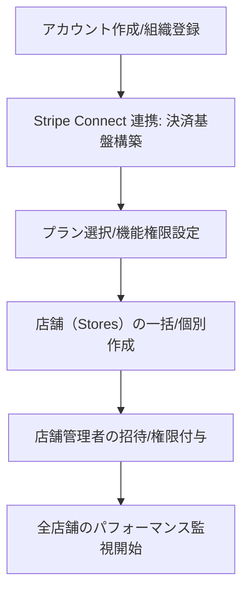
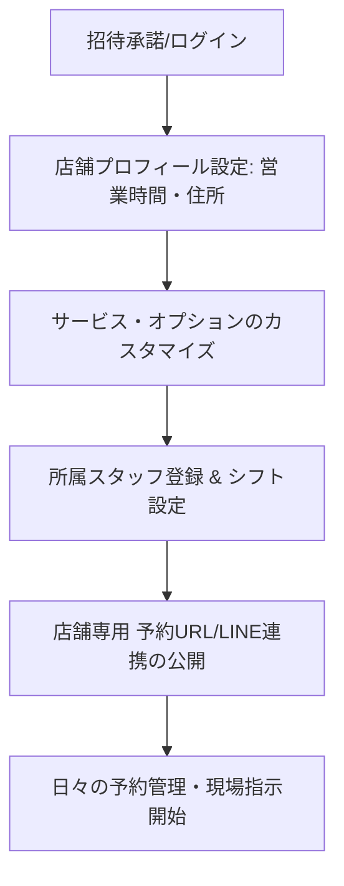
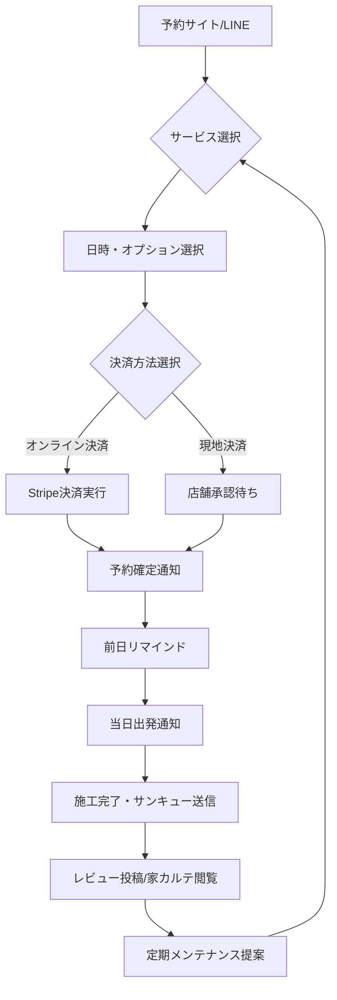
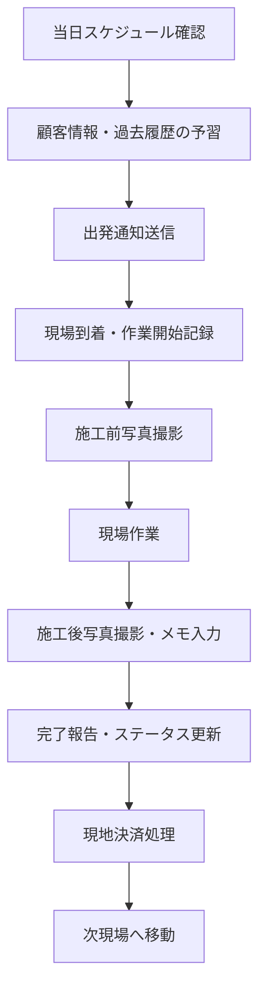
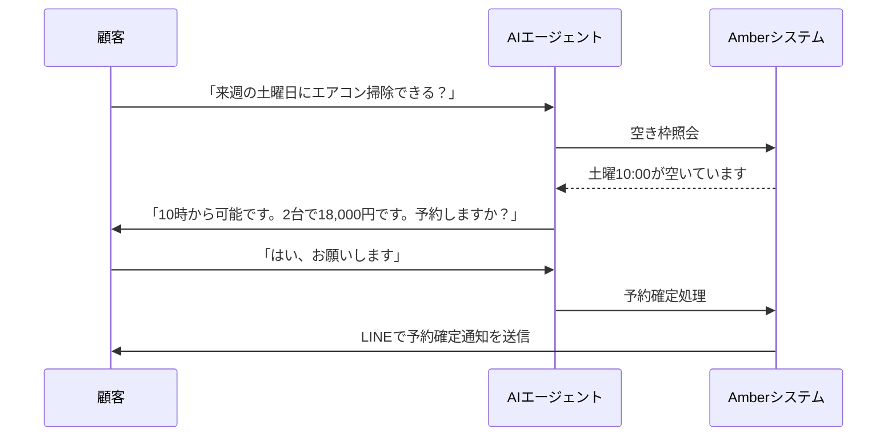

# ユーザージャーニー（User Journey）

本文書では、Amber プラットフォームにおける主要な役割（ロール）ごとの行動フローを定義します。特に事業者側（本部・店舗）のオンボーディングと運用の違いに焦点を当てます。

---

## 0. 事業者オンボーディング比較（Onboarding Comparison）

Amber はマルチテナント構造を採用しており、フランチャイズ本部（Super Admin）と各店舗管理者（Store Admin）では、開始までのステップが異なります。

### A. フランチャイズ本部 / 経営者（Super Admin）
組織全体のオーナーとして、インフラと決済基盤を構築します。

### B. 店舗管理者 / 店長（Store Admin）
特定の店舗の責任者として、現場の稼働環境を整えます。

---

## 1. 役割別の主な運用フロー（Operational Flows）

| 役割 | オンボーディングの鍵 | 日次の主要アクション | 意思決定の範囲 |
| :--- | :--- | :--- | :--- |
| **フランチャイズ本部** | 決済基盤（Stripe）と組織構造の定義 | 全店舗の売上監視、手数料精算、新店舗開設 | 組織全体のプラン、全店舗のデータ閲覧 |
| **店舗管理者** | リソース（スタッフ・シフト）の確定 | 予約調整、スタッフへの指示、顧客対応、店舗売上管理 | 自店舗のメニュー価格、シフト、自店舗顧客 |
| **現場スタッフ** | アプリの使い方と施工記録の習得 | ステータス更新（開始/完了）、施工写真・メモ登録 | 自身の担当予約の詳細確認・記録 |

---

## 2. 顧客のジャーニー（Customer Journey）

一般消費者がサービスを発見し、予約・決済を経て施工完了、その後のリピートに至るまでのフローです。

---

## 3. 現場スタッフのジャーニー（Staff Journey）

現場で作業を行うスタッフが、一日のスケジュールを確認し、現場での作業を記録・報告するフローです。

---

## 4. 将来のジャーニー（Phase 2.0+: AI Agent）

AIが電話やLINEで顧客と対話し、自動で予約を完結させる高度なフローです。

